# How to use?

**Step 0:**

Download the code from this repo.

##

**Step 1:**

Open your Markers and log in.
Go to one of your collections at a time.

**Step 2:**

Go to inspect element.

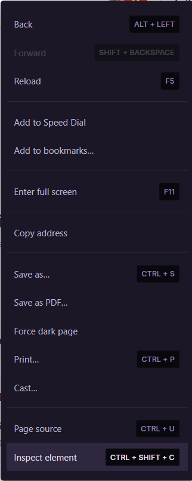

**Step 3:**

Go to the network tab in the element inspector.
This is sometimes in the lint:

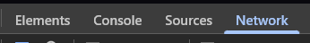

But can also be in a hamburger menu like this:

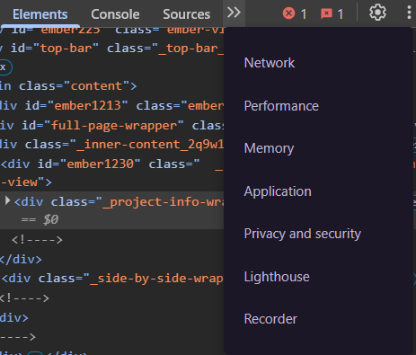

**Step 4:**

Refresh the Markers page with the network tab open.
If it went well, you would see something like this in the network tab:

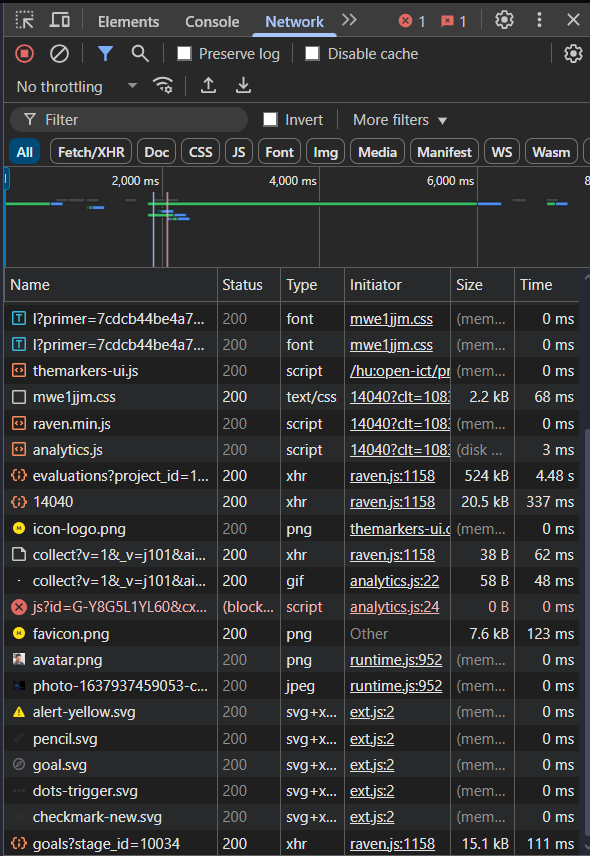

**Step 5:**

We are searching for a specific part in here and we can easily find it by sorting things on time by clicking 2 times on the time part in the network tab so there is a downwards arrow next to "time":

before:

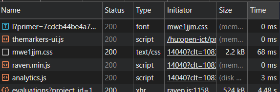

after:

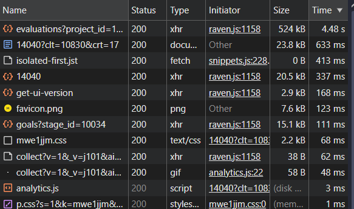

**Step 6:**

Click on the part that i probably at the top because it took long to load and if not, its name starts with "evaluation" and has an orange ";" in front of it:

before:

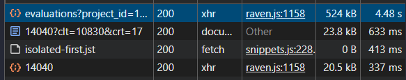

after:

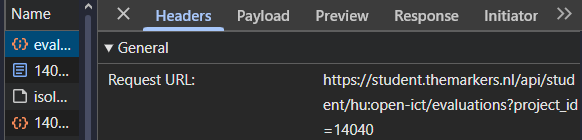

**Step 7:**

Copy this part:

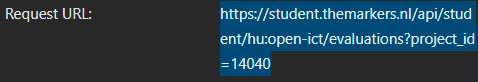

and place it in a new browser tab as the url:

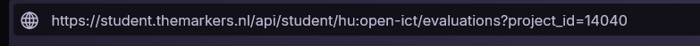

and hit enter.

If done correctly, the page will load for probably a few seconds and then show something like this after we click "pretty-print":

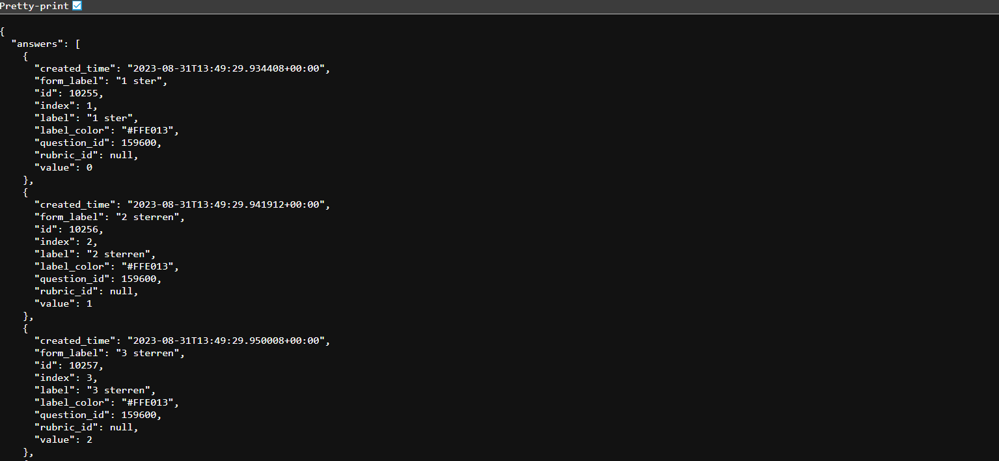

**Step 8:**

Copy all the text in that browser window and save it in a JSON file next to the python code from this repo as "markers.json":

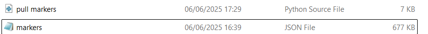

**Step 9:**

If you now run the puthon code, there should appear an output directory next to the python code with everything you uploaded to Markers.

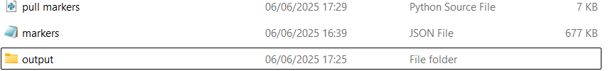